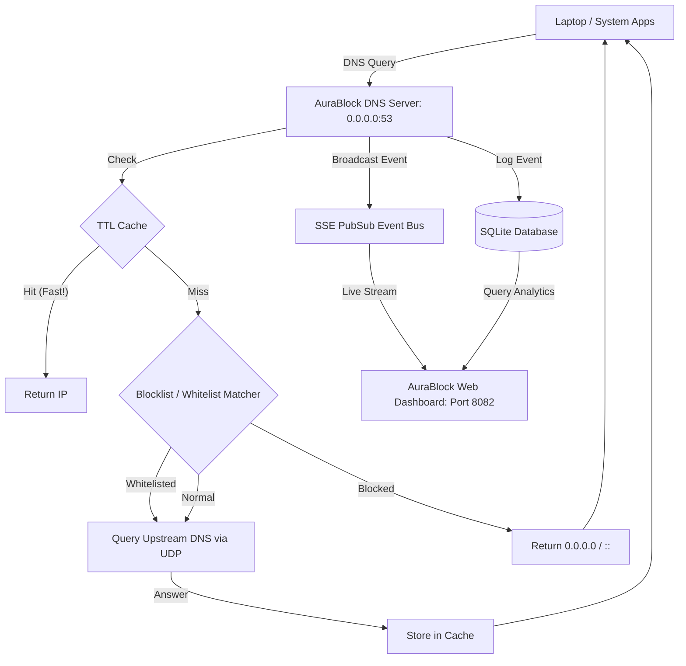

# AuraBlock 🛡️
### Ultra-Premium, Device-Wide DNS AdBlocker & Security Suite for Linux

AuraBlock is a lightweight, high-performance, system-wide DNS sinkhole (similar to Pi-hole) designed specifically for Linux. It runs as a background service, intercepting system-wide DNS queries to filter out advertisements, trackers, and malicious domains before they are ever downloaded by your browser, applications, or background processes.

---

## Architecture Diagram



---

## Features

1. **Device-Wide Ad Blocking**: Blocks ads, popups, metrics, and tracking scripts in **all** applications, including browsers, Spotify, Steam, Discord, and system updates.
2. **Ultra-Fast Engine**: Written in Go with O(1) domain lookups, suffix-matching subdomain resolution, and an in-memory TTL caching layer.
3. **Stunning Web Dashboard**: An ultra-premium, dark-themed dashboard featuring real-time analytical charts (via Chart.js), stats, and dynamic settings.
4. **Real-time Query Stream**: Streams DNS requests live to your dashboard using Server-Sent Events (SSE) for zero-lag system monitoring.
5. **No CGO Dependency**: Uses a pure Go SQLite engine (`modernc.org/sqlite`) making compilation portable and dependency-free.
6. **Polite System Service**: Integrates with systemd, runs as a non-root user (`aurablock`) using Linux Capabilities (`CAP_NET_BIND_SERVICE`) to securely bind to port 53.

---

## Directory Structure

```
aurablock/
├── backend/
│   ├── api.go          # HTTP REST API server & SSE Stream
│   ├── blocklist.go    # Blocklist downloader, parser, & matcher
│   ├── db.go           # SQLite logger & analytics database
│   ├── dns.go          # DNS server, TTL caching, & query forwarder
│   ├── main.go         # Entry point & graceful shutdown handler
│   ├── go.mod          # Go modules configuration
│   └── dist/           # Frontend Web Dashboard assets
│       ├── index.html  # Dashboard UI structure
│       ├── style.css   # Neon glassmorphism styling stylesheet
│       └── app.js      # SSE controller & Chart.js renderer
├── install.sh          # Automated installer bash script
└── README.md           # Documentation
```

---

## How to Install and Run

### Step 1: Clone or Access Folder
Navigate to the project folder:
```bash
cd /home/cyber/CODES/aurablock
```

### Step 2: Run the Installer
Run the automated `install.sh` script with root privileges to build the Go backend, copy files, and setup the systemd daemon:
```bash
sudo ./install.sh
```

### Step 3: Access the Dashboard
Once installed, the dashboard will be available at:
👉 **[http://localhost:8082](http://localhost:8082)**

---

## System Integration (DNS Redirection)

AuraBlock runs on `127.0.0.1:53`. To route your system's traffic through it, apply one of the following methods:

### Method A: Edit `/etc/resolv.conf` (Direct & Instant)
Open `/etc/resolv.conf` and set AuraBlock as the sole nameserver:
```ini
nameserver 127.0.0.1
```
*Note: NetworkManager or Tailscale may overwrite this file on reboot or network change.*

### Method B: Configure NetworkManager (Persistent for Wi-Fi/Ethernet)
1. Open your network settings editor (e.g. `nm-connection-editor` or GNOME Settings).
2. Go to the IPv4 tab of your active connection.
3. Set the DNS server to `127.0.0.1`.
4. Turn off **Automatic DNS** (so your router's default DNS is ignored).

### Method C: Configure systemd-resolved
If systemd-resolved is active, edit `/etc/systemd/resolved.conf`:
```ini
[Resolve]
DNS=127.0.0.1
```
Then restart systemd-resolved:
```bash
sudo systemctl restart systemd-resolved
```

---

## Developers & Customizing

To run the AuraBlock core manually in debug mode:
```bash
cd backend
go run . -dns-addr=127.0.0.1:5353 -api-port=8082 -db-path=debug.db
```
This runs the DNS resolver on port `5353` (no root required) and the dashboard API on port `8082`.

---

## AuraBlock Shield (Browser Extension)

AuraBlock includes an enterprise-grade Chrome/Chromium browser extension (`AuraBlock Shield`) powered by uBlock Origin Lite. This extension is automatically packaged as a `.crx` file and deployed via system policies.

### Extension Deployment
During `install.sh`, the system generates an `aurablock-shield.crx` and automatically injects an `ExtensionInstallForcelist` policy into your local Chromium/Chrome browsers. This ensures the extension is silently installed without user intervention and prevents users from disabling it.

The extension uses the highly efficient Declarative Net Request (DNR) API, making it extremely fast while blocking first-party ads (like YouTube video ads) that traditional DNS blockers cannot stop.
